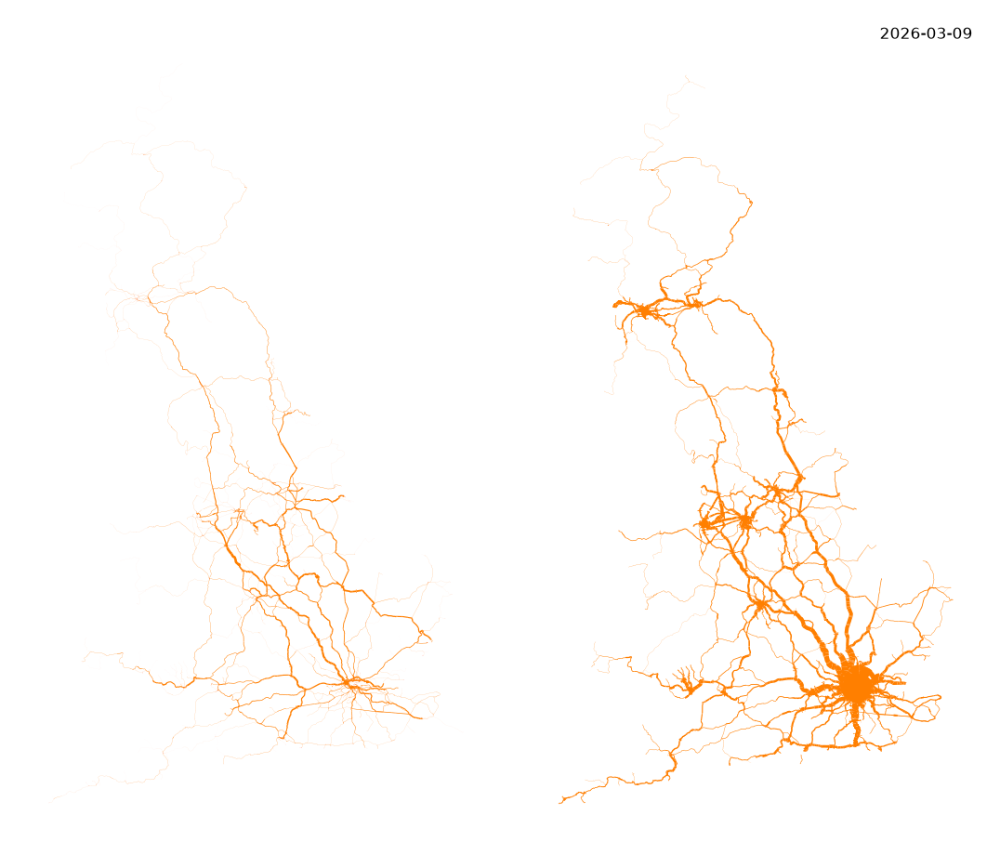
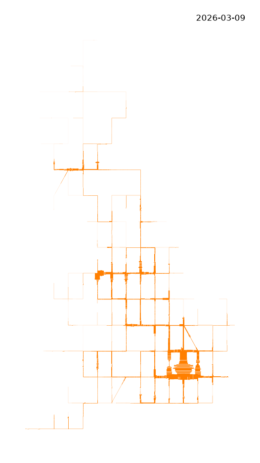
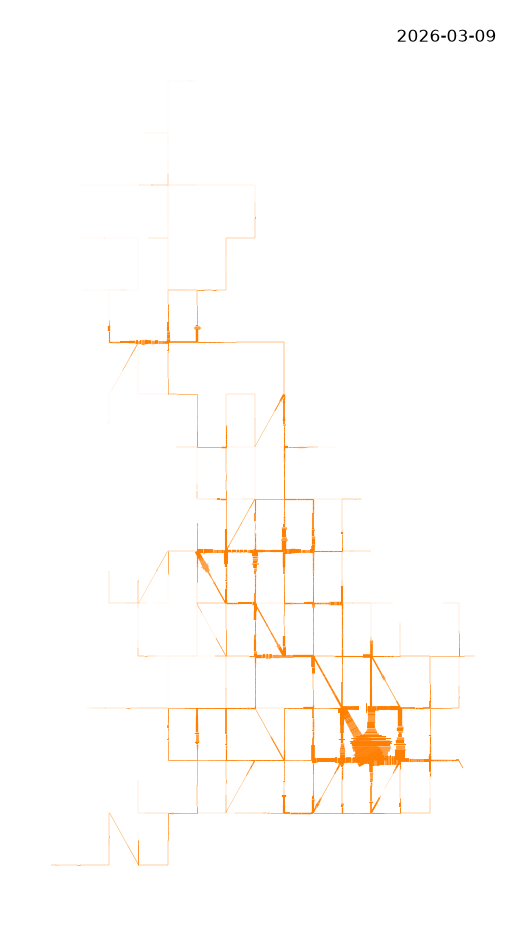
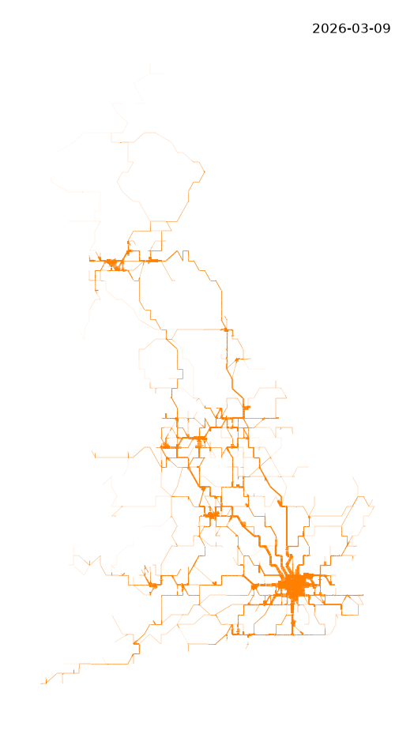
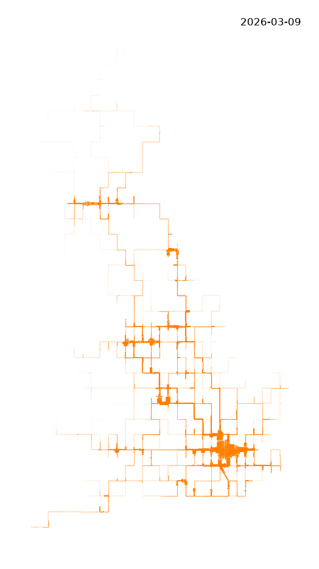
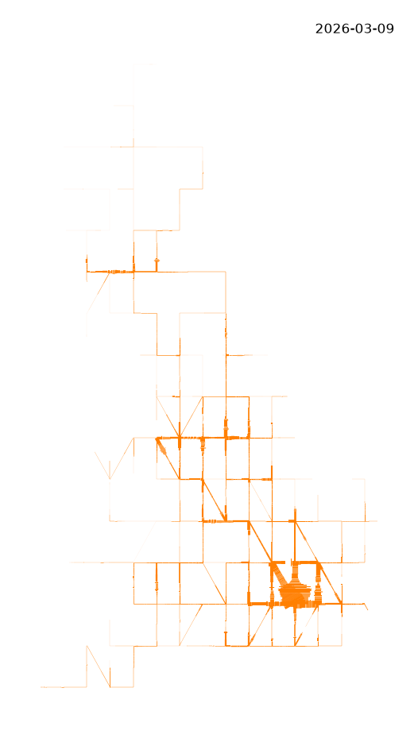
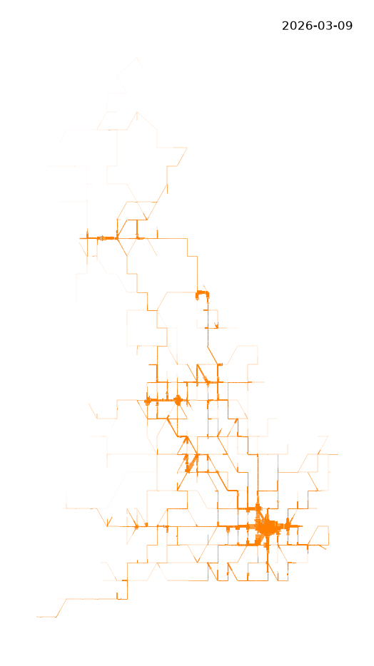
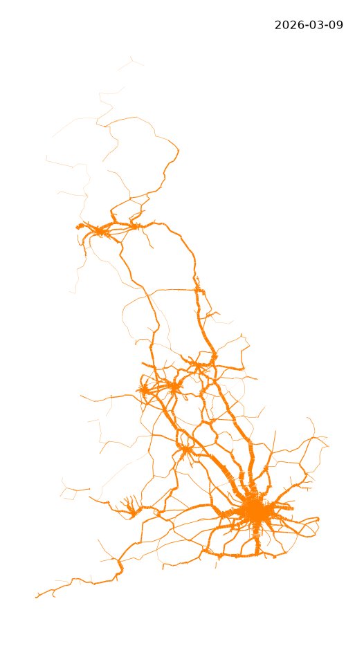

## Centre-Line Network Model 

For those interested in such things, here is a visualization of timetabled passenger and freight movement on the #British heavy-rail network, aggregated over the week 2026-03-09 to 2026-03-15. This shows movement of train services based on TIPLOC to TIPLOC segments on maps with a series of [TopoJSON simplification](https://github.com/topojson/topojson-specification) network simplification applied to a base map projected in [OSGB36 (EPSG:27000)](https://epsg.io/27700), varying scale and quantization.

```#rail``` ```#passenger``` ```#freight``` ```#data``` ```#visualization```

### Static
Aggregated heavy railway weekly services 2026 03 09 with [TopoJSON simplification](https://github.com/topojson/topojson-specification) 

### Network Model
No simplification or quantization.

::: {layout-ncol=1}
{fig-align=center width=100% fig-alt="A map as orange lines with showing heavy railway freight (left) and passenger services (right) the width proportional to the aggregated number of services that operated on week of 9 March 2026. The line width is proportional to the number of timetabled services that operated." .lightbox}
Freight services (left) and Passenger services (right)
:::

### Topo Model quantize 16 vary scale

::: {layout-ncol=2}
{fig-align=center width=100% fig-alt="A map as orange lines with showing heavy railway freight (left) and passenger services (right) the width proportional to the aggregated number of services that operated on week of 9 March 2026. The line width is proportional to the number of timetabled services that operated." .lightbox}

{fig-align=center width=100% fig-alt="A map as orange lines with showing heavy railway freight (left) and passenger services (right) the width proportional to the aggregated number of services that operated on week of 9 March 2026. The line width is proportional to the number of timetabled services that operated." .lightbox}

{fig-align=center width=100% fig-alt="A map as orange lines with showing heavy railway freight (left) and passenger services (right) the width proportional to the aggregated number of services that operated on week of 9 March 2026. The line width is proportional to the number of timetabled services that operated." .lightbox}

{fig-align=center width=100% fig-alt="A map as orange lines with showing heavy railway freight (left) and passenger services (right) the width proportional to the aggregated number of services that operated on week of 9 March 2026. The line width is proportional to the number of timetabled services that operated." .lightbox}
:::


### Topo Model quantize 64 vary scale

::: {layout-ncol=2}
{fig-align=center width=100% fig-alt="A map as orange lines with showing heavy railway freight (left) and passenger services (right) the width proportional to the aggregated number of services that operated on week of 9 March 2026. The line width is proportional to the number of timetabled services that operated." .lightbox}

{fig-align=center width=100% fig-alt="A map as orange lines with showing heavy railway freight (left) and passenger services (right) the width proportional to the aggregated number of services that operated on week of 9 March 2026. The line width is proportional to the number of timetabled services that operated." .lightbox}

{fig-align=center width=100% fig-alt="A map as orange lines with showing heavy railway freight (left) and passenger services (right) the width proportional to the aggregated number of services that operated on week of 9 March 2026. The line width is proportional to the number of timetabled services that operated." .lightbox}

{fig-align=center width=100% fig-alt="A map as orange lines with showing heavy railway freight (left) and passenger services (right) the width proportional to the aggregated number of services that operated on week of 9 March 2026. The line width is proportional to the number of timetabled services that operated." .lightbox}
:::

### Topo Model quantize 128 vary scale 

::: {layout-ncol=2}
{fig-align=center width=100% fig-alt="A map as orange lines with showing heavy railway freight (left) and passenger services (right) the width proportional to the aggregated number of services that operated on week of 9 March 2026. The line width is proportional to the number of timetabled services that operated." .lightbox}

{fig-align=center width=100% fig-alt="A map as orange lines with showing heavy railway freight (left) and passenger services (right) the width proportional to the aggregated number of services that operated on week of 9 March 2026. The line width is proportional to the number of timetabled services that operated." .lightbox}

{fig-align=center width=100% fig-alt="A map as orange lines with showing heavy railway freight (left) and passenger services (right) the width proportional to the aggregated number of services that operated on week of 9 March 2026. The line width is proportional to the number of timetabled services that operated." .lightbox}

{fig-align=center width=100% fig-alt="A map as orange lines with showing heavy railway freight (left) and passenger services (right) the width proportional to the aggregated number of services that operated on week of 9 March 2026. The line width is proportional to the number of timetabled services that operated." .lightbox}
:::

### Topo Model scale 1 vary quantization
::: {layout-ncol=2}
{fig-align=center width=100% fig-alt="A map as orange lines with showing heavy railway freight (left) and passenger services (right) the width proportional to the aggregated number of services that operated on week of 9 March 2026. The line width is proportional to the number of timetabled services that operated." .lightbox}

{fig-align=center width=100% fig-alt="A map as orange lines with showing heavy railway freight (left) and passenger services (right) the width proportional to the aggregated number of services that operated on week of 9 March 2026. The line width is proportional to the number of timetabled services that operated." .lightbox}

{fig-align=center width=100% fig-alt="A map as orange lines with showing heavy railway freight (left) and passenger services (right) the width proportional to the aggregated number of services that operated on week of 9 March 2026. The line width is proportional to the number of timetabled services that operated." .lightbox}

{fig-align=center width=100% fig-alt="A map as orange lines with showing heavy railway freight (left) and passenger services (right) the width proportional to the aggregated number of services that operated on week of 9 March 2026. The line width is proportional to the number of timetabled services that operated." .lightbox}

{fig-align=center width=100% fig-alt="A map as orange lines with showing heavy railway freight (left) and passenger services (right) the width proportional to the aggregated number of services that operated on week of 9 March 2026. The line width is proportional to the number of timetabled services that operated." .lightbox}

{fig-align=center width=100% fig-alt="A map as orange lines with showing heavy railway freight (left) and passenger services (right) the width proportional to the aggregated number of services that operated on week of 9 March 2026. The line width is proportional to the number of timetabled services that operated." .lightbox}
:::


### Topo Model scale 10^7^ vary quantization

::: {layout-ncol=2}

{fig-align=center width=100% fig-alt="A map as orange lines with showing heavy railway freight (left) and passenger services (right) the width proportional to the aggregated number of services that operated on week of 9 March 2026. The line width is proportional to the number of timetabled services that operated." .lightbox}


{fig-align=center width=100% fig-alt="A map as orange lines with showing heavy railway freight (left) and passenger services (right) the width proportional to the aggregated number of services that operated on week of 9 March 2026. The line width is proportional to the number of timetabled services that operated." .lightbox}

{fig-align=center width=100% fig-alt="A map as orange lines with showing heavy railway freight (left) and passenger services (right) the width proportional to the aggregated number of services that operated on week of 9 March 2026. The line width is proportional to the number of timetabled services that operated." .lightbox}

{fig-align=center width=100% fig-alt="A map as orange lines with showing heavy railway freight (left) and passenger services (right) the width proportional to the aggregated number of services that operated on week of 9 March 2026. The line width is proportional to the number of timetabled services that operated." .lightbox}

{fig-align=center width=100% fig-alt="A map as orange lines with showing heavy railway freight (left) and passenger services (right) the width proportional to the aggregated number of services that operated on week of 9 March 2026. The line width is proportional to the number of timetabled services that operated." .lightbox}

{fig-align=center width=100% fig-alt="A map as orange lines with showing heavy railway freight (left) and passenger services (right) the width proportional to the aggregated number of services that operated on week of 9 March 2026. The line width is proportional to the number of timetabled services that operated." .lightbox}

{fig-align=center width=100% fig-alt="A map as orange lines with showing heavy railway freight (left) and passenger services (right) the width proportional to the aggregated number of services that operated on week of 9 March 2026. The line width is proportional to the number of timetabled services that operated." .lightbox}

{fig-align=center width=100% fig-alt="A map as orange lines with showing heavy railway freight (left) and passenger services (right) the width proportional to the aggregated number of services that operated on week of 9 March 2026. The line width is proportional to the number of timetabled services that operated." .lightbox}
:::


### Reference and License

This is published under [CC BY 4.0 Attribution](https://creativecommons.org/licenses/by/4.0/deed.en) and details about the [licenses and open data used](https://anisotropi4.github.io/shed/opendata.html).

